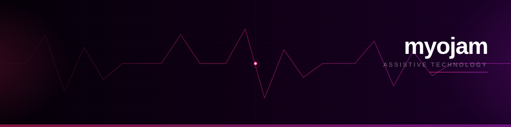
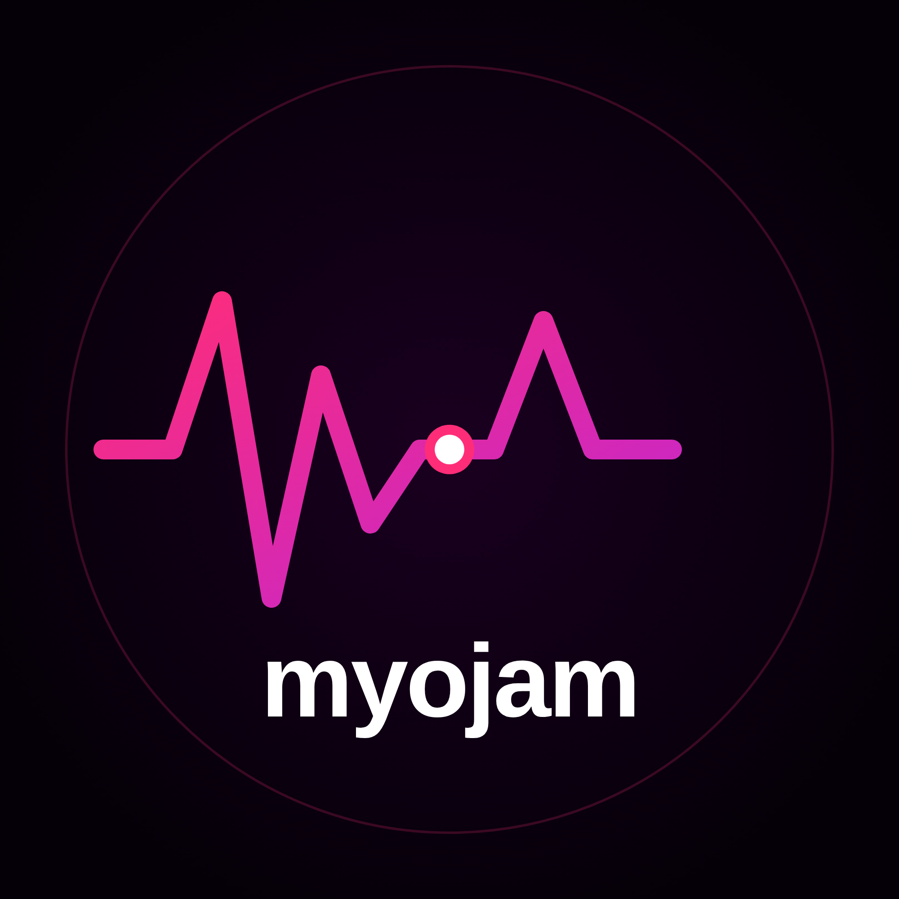

<p align="center">
  
</p>

<p align="center">
  
</p>

<h1 align="center">myojam</h1>

<p align="center">Real-time EMG gesture classification for assistive human-computer interaction - with an open education platform built on top of the research.</p>

<p align="center">
  <a href="https://myojam.com"></a>
  <a href="LICENSE"></a>
  <a href="#performance"></a>
</p>

---

## What it does

myojam reads surface electromyographic (EMG) signals from forearm muscles and classifies hand gestures in real time, enabling people with motor impairments to control a computer through muscle signals alone.

**6 gesture classes:** index flex · middle flex · ring flex · pinky flex · thumb flex · fist

Each gesture maps to a computer action: cursor left/right, scroll up/down, left click, spacebar.

## Performance

| Metric | Value |
|--------|-------|
| Cross-subject accuracy | **84.85%** |
| Training subjects | 10 (Ninapro DB5) |
| EMG channels | 16 surface electrodes |
| Feature vector | 64-dimensional (MAV, RMS, ZC, WL x 16 ch) |
| Classifier | Random Forest (500 trees) |
| Inference latency | < 5 ms |

Evaluated under leave-one-subject-out (LOSO) cross-validation.

## Architecture

```
EMG Electrodes -> MyoWare 2.0 -> Arduino Uno -> USB Serial
                                                    |
                              FastAPI Backend (signal processing + inference)
                                                    |
                        React Web App  <->  macOS Desktop App
```

## Stack

| Layer | Technology |
|-------|-----------|
| Signal processing | Python, SciPy, NumPy |
| ML model | scikit-learn Random Forest |
| Backend API | FastAPI (Render) |
| Web frontend | React, Vite, Three.js, OGL (WebGL) |
| Desktop app | PyQt6, Quartz (macOS) |
| Hardware | MyoWare 2.0, Arduino Uno R3 |

## Interactive demos

All demos run in the browser - no hardware or install required.

| Demo | Description |
|------|-------------|
| [Live Signal](https://myojam.com/signal) | Real-time dataset playback with 3D hand model, confidence bars, and action log |
| [Signal Guesser](https://myojam.com/guess) | 5-round game: identify a gesture from real EMG waveforms before the AI does |
| [Signal Playground](https://myojam.com/playground) | Draw a waveform with your mouse and watch MAV, RMS, ZC, WL update live |
| [Gesture Game](https://myojam.com/game) | Match target gestures against the clock, three difficulty levels |
| [Confusion Explorer](https://myojam.com/confusion) | Interactive confusion matrix from the 10-subject test set |
| [Frequency Analyzer](https://myojam.com/frequency) | Explore the spectral properties of EMG signals |
| [Pipeline Explorer](https://myojam.com/pipeline) | Walk through each stage of the signal processing pipeline with real data |
| [MyoCode](https://myojam.com/myocode) | A Scratch-like block coding environment triggered by EMG gestures |

## Education platform

11 articles, 3 structured lesson plans (NGSS/AP/IB aligned), and an interactive tool suite for classrooms. No hardware required to teach the concepts.

- [EMG Explainer](https://myojam.com/education/emg-explainer) - from motor cortex to gesture prediction
- [Why EMG is Hard](https://myojam.com/education/why-emg-is-hard) - noise, placement variability, individual anatomy
- [Build Your Own](https://myojam.com/education/build-your-own) - $68 hardware setup, full wiring guide
- [Educator Hub](https://myojam.com/educators) - lesson plans, rubrics, curriculum alignment

## Research

Four peer-structured papers published at [myojam.com/research](https://myojam.com/research):

1. **Main paper** - classifier design, dataset, evaluation methodology
2. **Classifier Analysis** - Random Forest vs SVM vs KNN cross-subject comparison
3. **Variability Review** - sources of cross-subject accuracy loss
4. **Windowing Analysis** - window size vs accuracy vs latency trade-offs

## Download

macOS desktop app available from [Releases](https://github.com/Jaden300/myojam/releases/latest).

**Requirements:** macOS 12+, Python 3.13, cliclick (`brew install cliclick`)

```bash
pip3 install PyQt6 scipy scikit-learn numpy pyserial
chmod +x run.sh && ./run.sh
```

Grant Accessibility permission when prompted (System Settings -> Privacy & Security -> Accessibility).

## Hardware setup

1. Place bipolar EMG electrodes on the forearm flexor muscle belly
2. Connect MyoWare 2.0 via Link Shield + TRS cable to Arduino Shield
3. Connect Arduino Uno to Mac via USB (laptop on battery power)
4. Upload `arduino_sketch/emg_stream.ino` via Arduino IDE
5. Click "Connect sensor" in the app

## Train your own model

```bash
python3 collect_data.py    # record your gestures - 60 samples each
python3 train_my_model.py  # trains and saves a personalized model
```

Per-user calibration improves accuracy significantly. Cross-subject baseline is ~85%; within-session can exceed 95%.

## Project structure

```
myojam/
|- frontend/                   # React web app (Vite + React Router)
|  |- src/
|  |  |- articles/             # long-form education articles
|  |  |- components/           # reusable UI components
|  |  \- educators/            # lesson plan pages
|  \- public/
|
|- backend/                    # FastAPI inference server (Render)
|  |- main.py
|  \- requirements.txt
|
|- desktop-app/                # PyQt6 macOS application
|  |- myojam.py                # main app
|  |- keywatcher.py            # global keyboard listener (Quartz)
|  |- collect_data.py          # personal EMG data collection
|  |- train_my_model.py        # model training pipeline
|  |- emg_classifier.py        # classifier logic
|  |- arduino_sketch/          # Arduino firmware (emg_stream.ino)
|  \- model/                   # trained model files (.pkl)
|
|- data/                       # Ninapro DB5 dataset (10 subjects)
|  \- DB5_s*/
|
|- model/                      # shared model files used by backend
|- scripts/                    # development & validation scripts
|- docs/                       # brand assets
\- vercel.json                 # SPA routing config for Vercel
```

## Team

Built by [Jaden W.](https://github.com/Jaden300) with contributions from Matthew T. and Darren N.

## License

MIT - see [LICENSE](LICENSE) for details.

---

© 2025 myojam™
